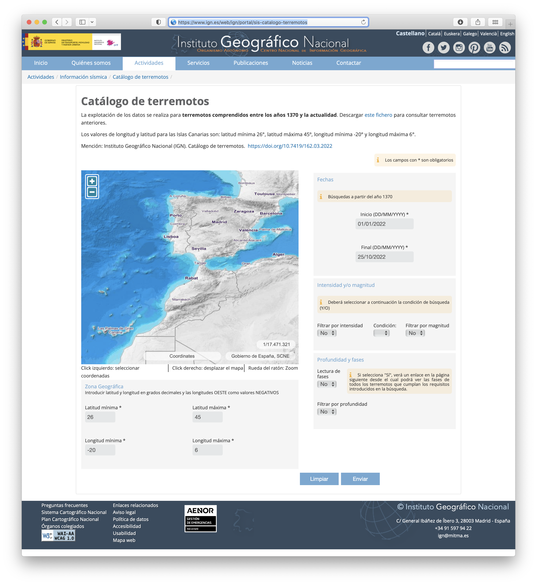

# Getting seismic catalogs

Hypocenters and phase data from the [IGN](https://www.ign.es/) can be downloaded from the
[catalog search page](https://www.ign.es/web/ign/portal/sis-catalogo-terremotos).

Hypocenter data can be obtained in two formats:

- text file format with hypocenters only
- text file in IMS format including hypocenters and phase data

